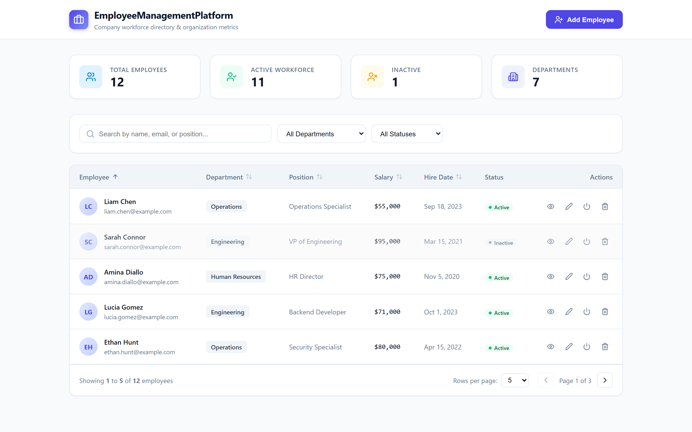
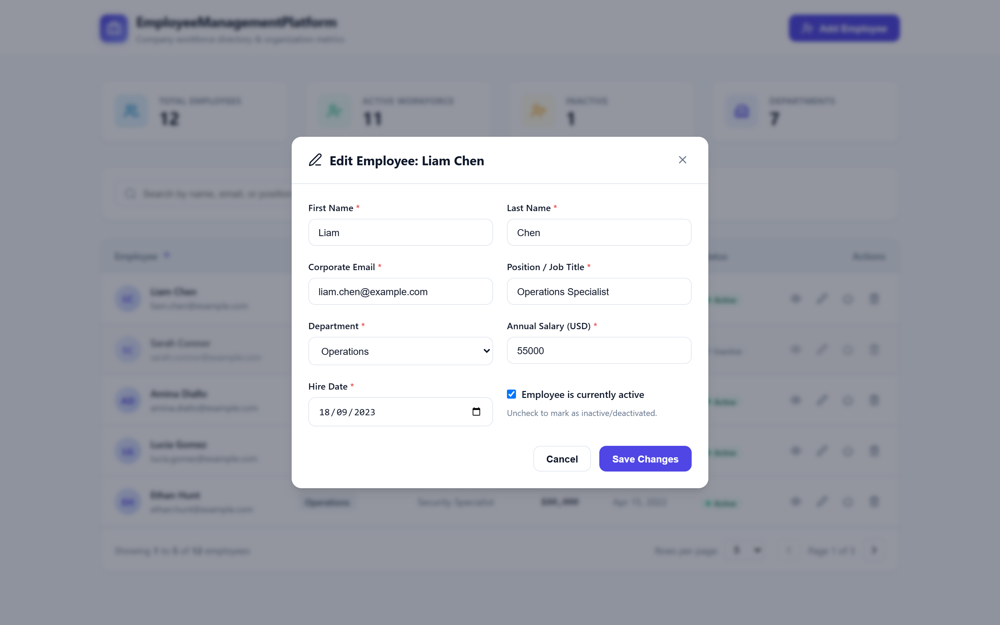
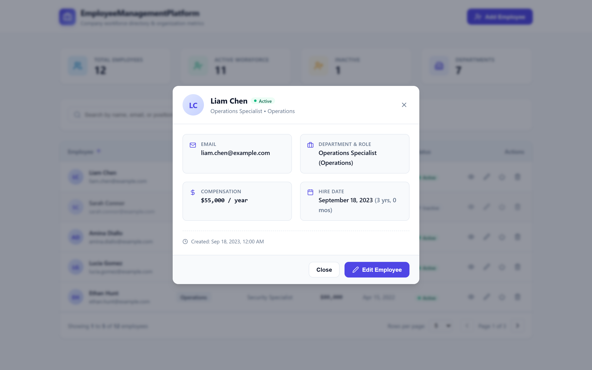
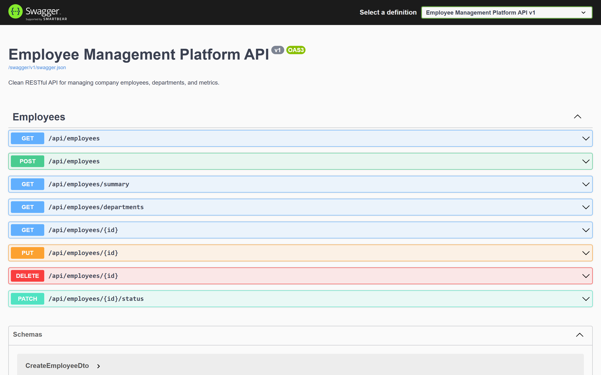
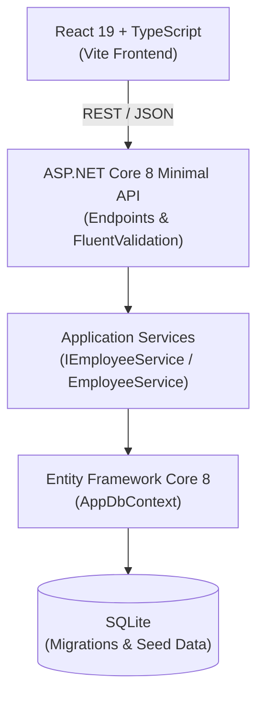

# Employee Management Platform

> A full-stack employee management platform built with ASP.NET Core 8, React 19, and TypeScript, featuring server-side querying, dual-layer validation, automated test suites, and CI.

[](https://dotnet.microsoft.com/)
[](https://react.dev/)
[](https://www.typescriptlang.org/)
[](https://vitejs.dev/)
[](EmployeeManagementPlatform.Tests/)
[](https://github.com/led-21/EmployeeManagementPlatform/actions/workflows/ci.yml)
[](LICENSE)



## Overview

**Employee Management Platform** is a full-stack web application that pairs an **ASP.NET Core 8 Minimal API** backend with a **React 19 + TypeScript** single-page frontend. It provides a complete workforce directory with real-time KPI metrics, full CRUD lifecycle operations, and server-side search, department/status filtering, multi-column sorting, and pagination backed by **Entity Framework Core 8** and **SQLite**.

The codebase emphasizes clean separation between API endpoints, application services, domain models, and typed frontend integration. Input rules and email uniqueness are enforced through **FluentValidation** with standardized `ProblemDetails` error responses, verified by automated backend (**xUnit**) and frontend (**Vitest**) test suites running in **GitHub Actions CI**.

## Highlights

- **REST API with ASP.NET Core 8 Minimal APIs** — Typed route groups, OpenAPI metadata, and standardized status codes.
- **Server-Side Search, Filtering, Sorting & Pagination** — Composable EF Core `IQueryable` pipelines executed directly in SQL.
- **React 19 + TypeScript 6 Frontend** — Responsive dashboard with KPI summary cards, sortable table, and modal workflows.
- **FluentValidation & RFC 7807 Error Contracts** — Backend domain rules and conflict checks mapped to `ValidationProblemDetails`.
- **EF Core 8 + SQLite Persistence** — Indexed schema (`Email`, `Department`, `Active`) with automatic migration and synthetic seed data on startup.
- **Automated Backend & Frontend Test Suites** — 23 xUnit backend tests and 13 Vitest + React Testing Library frontend tests.
- **GitHub Actions CI** — Automated build, type-checking, and test execution on push and pull requests.

## Application Preview

### Workforce Dashboard

The main view presents live organizational KPIs, debounced text search, department and status filters, sortable directory columns, and server-side pagination controls.


| Employee Form | Employee Details |
| --- | --- |
|  |  |

| Interactive OpenAPI / Swagger UI |
| --- |
|  |

## Architecture



Request validation is handled at the API boundary with **FluentValidation** before delegating to `EmployeeService`. Quality and build integrity across both tiers are verified with **xUnit**, **Vitest**, and **GitHub Actions CI**.

## Tech Stack

| Layer | Technology |
| --- | --- |
| Backend | ASP.NET Core 8 (`.NET 8.0`, Minimal APIs, Swashbuckle OpenAPI) |
| Data | Entity Framework Core 8 (`8.0.4`) + SQLite |
| Validation | FluentValidation (`12.1.1`) |
| Frontend | React `19.3` + TypeScript `6.0` |
| Build | Vite `8.3` |
| Backend Tests | xUnit (`2.5.3`) + EF Core InMemory (`8.0.4`) |
| Frontend Tests | Vitest (`5.0.2`) + React Testing Library (`16.3.3`) |
| CI | GitHub Actions |

## Key Engineering Details

- **Server-Side `IQueryable` Composition**: `EmployeeService.GetAllAsync` composes search (`EF.Functions.Like` across first name, last name, email, and position), department and active status filters, and `CountAsync` before materializing results.
- **`AsNoTracking` Read Queries**: Directory listings and detail lookups use `.AsNoTracking()` to avoid change-tracker overhead on read-only operations.
- **Dynamic Multi-Column Sorting & `Skip`/`Take` Pagination**: Supports ascending/descending sorting across `name`, `department`, `position`, `salary`, `hiredate`, and `createdat` with bounded page sizes (`1..100`).
- **Unique Email Enforcement**: Enforced both via a unique database index (`IX_Employees_Email`) and normalized service-level conflict checks (`409 Conflict` via `ProblemDetails`).
- **Standardized `ProblemDetails` Error Handling**: Validation failures return `400 Bad Request` with field-level `ValidationProblemDetails` dictionaries; missing resources and duplicate emails return structured `404` and `409` responses.
- **Typed Frontend API Client**: `src/services/api.ts` and `src/services/employees.ts` wrap `fetch` with strict TypeScript DTOs and parse `ProblemDetails` payloads into a custom `ApiError` class.
- **Debounced Search & Shared Validation Behavior**: Search input is debounced (`300ms`) to minimize API traffic, while `EmployeeForm` pairs immediate client-side validation rules with server-side field error rendering.
- **Zero-Config Synthetic Seeding**: On startup, `Program.cs` applies EF Core migrations automatically and seeds 12 synthetic employee records across 7 departments.

## API

All endpoints are grouped under `/api/employees`:

| Method | Endpoint | Summary | Status Codes |
| --- | --- | --- | --- |
| `GET` | `/api/employees` | Paginated directory (`search`, `department`, `active`, `sortBy`, `sortOrder`, `page`, `pageSize`) | `200 OK` |
| `GET` | `/api/employees/summary` | Workforce KPI metrics and department distribution | `200 OK` |
| `GET` | `/api/employees/departments` | Distinct sorted list of department names | `200 OK` |
| `GET` | `/api/employees/{id}` | Employee details by ID | `200 OK`, `404 Not Found` |
| `POST` | `/api/employees` | Create a new employee | `201 Created`, `400 Bad Request`, `409 Conflict` |
| `PUT` | `/api/employees/{id}` | Update an existing employee | `200 OK`, `400 Bad Request`, `404 Not Found`, `409 Conflict` |
| `PATCH` | `/api/employees/{id}/status` | Toggle employee active/inactive status | `200 OK`, `404 Not Found` |
| `DELETE` | `/api/employees/{id}` | Permanently delete an employee | `204 No Content`, `404 Not Found` |

Interactive Swagger/OpenAPI documentation is available locally at `/swagger` when running in Development mode.

## Run Locally

### Prerequisites

- [.NET 8.0 SDK](https://dotnet.microsoft.com/download/dotnet/8.0)
- [Node.js 22 LTS](https://nodejs.org/) and npm

### 1. Start the Backend API

```bash
dotnet restore
dotnet run --project EmployeeManagementPlatform.Api --launch-profile http
```

- **API**: `http://localhost:5233`
- **Swagger UI**: `http://localhost:5233/swagger`

The SQLite database (`employees.db`) is automatically created, migrated, and seeded on first run.

### 2. Start the Frontend

```bash
cd frontend
npm install
npm run dev
```

- **Frontend**: `http://localhost:5173` (requests to `/api` are proxied to `http://localhost:5233` via Vite).

## Testing

Automated backend and frontend test suites validate service queries, domain validation rules, and UI component workflows.

### Backend Tests (xUnit — 23 passing tests)

```bash
dotnet test
```

Covers `EmployeeService` (CRUD, search, department/status filtering, sorting, pagination, KPI summary, duplicate email rejection) and `EmployeeValidators` (field constraints, identical first/last name prevention, salary bounds, and hire date rules).

### Frontend Tests (Vitest — 13 passing tests)

```bash
cd frontend
npm test
```

Covers `EmployeeForm`, `Pagination`, `SearchInput`, and `StatusBadge` using Vitest and React Testing Library.

## Continuous Integration

[](https://github.com/led-21/EmployeeManagementPlatform/actions/workflows/ci.yml)

The GitHub Actions workflow (`.github/workflows/ci.yml`) runs two parallel jobs on pushes and pull requests:

- **Backend (.NET 8)**: `dotnet restore`, `dotnet build --configuration Release`, and `dotnet test`.
- **Frontend (React / Vite)**: `npm ci`, `npm run build` (`tsc && vite build`), and `npm run test`.

## Project Structure

```text
EmployeeManagementPlatform/
├── .github/workflows/
│   └── ci.yml                              # GitHub Actions CI pipeline
├── docs/images/                            # Application screenshots
├── EmployeeManagementPlatform.Api/         # ASP.NET Core 8 Minimal API
│   ├── Data/                               # AppDbContext & synthetic seed data
│   ├── DTOs/                               # Request/response records & PagedResult
│   ├── Endpoints/                          # /api/employees route definitions
│   ├── Interfaces/                         # IEmployeeService contract
│   ├── Migrations/                         # EF Core SQLite migrations
│   ├── Models/                             # Employee entity
│   ├── Services/                           # EmployeeService query & CRUD logic
│   ├── Validators/                         # FluentValidation validators
│   └── Program.cs                          # DI, middleware, CORS & auto-migration
├── EmployeeManagementPlatform.Tests/       # xUnit backend test suite
│   ├── Helper/                             # In-memory DbContext test helper
│   ├── EmployeeServiceTests.cs             # Service unit tests
│   └── EmployeeValidationTests.cs          # Validator unit tests
└── frontend/                               # React 19 + TypeScript + Vite SPA
    ├── src/
    │   ├── components/                     # Dashboard, table, modals & form UI
    │   ├── services/                       # Typed API client & ProblemDetails error handling
    │   ├── test/                           # Vitest + Testing Library suites
    │   ├── types/                          # Shared TypeScript interfaces
    │   └── App.tsx                         # Main application view & state coordination
    └── vite.config.ts                      # Vite dev server, API proxy & Vitest config
```

## Roadmap

- Authentication and role-based access control (RBAC)
- Containerized local development with Docker Compose
- Directory export to CSV / Excel
- PostgreSQL database provider profile for production deployments

## License

Licensed under the [MIT License](LICENSE).
