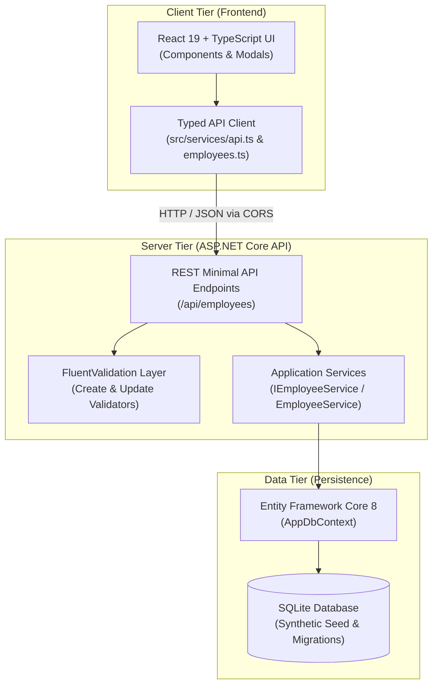

# Employee Management Platform

> A lightweight full-stack employee management application built with ASP.NET Core, React and TypeScript.

[](https://dotnet.microsoft.com/)
[](https://react.dev/)
[](https://www.typescriptlang.org/)
[](https://vitejs.dev/)
[](https://www.sqlite.org/)
[](https://github.com/led-21/EmployeeManagementPlatform/actions/workflows/ci.yml)

---

## Overview

**Employee Management Platform** is a modern, modular full-stack application designed to manage organizational workforce data effectively. Originally evolved from a simple backend technical exercise, the project was restructured into a production-grade portfolio application showcasing best practices in:

- **API Design**: Standardized REST Minimal APIs with OpenAPI / Swagger documentation and RFC 7807/9457 `ValidationProblemDetails`.
- **Clean Architecture & Separation of Concerns**: Decoupled domain models, application services with EF Core `IQueryable` server-side paging, and typed DTOs.
- **Robust Validation**: Dual-layer validation with **FluentValidation** on the backend and reactive, accessible UX feedback on the frontend.
- **Modern Frontend Architecture**: React 19 with TypeScript, Vite, custom responsive design system, debounced search, sortable tables, and modal workflows.
- **Automated Testing**: 100% passing test coverage across backend services, validations, and React component workflows.

---

## Features

- **Workforce KPI Cards**: Instant summary metrics displaying total employees, active count, inactive count, and department breakdown.
- **Search & Filtering**: Real-time debounced search by name, position, or corporate email, combined with department and active/inactive status filters.
- **Sortable & Paginated Table**: Server-side pagination with customizable page sizes (5, 10, 20, 50) and multi-column sorting (Name, Department, Position, Salary, Hire Date).
- **Employee CRUD Operations**:
  - **Create**: Add new employees with client and server validation.
  - **Details**: Modal inspection displaying compensation, contact info, formatted dates, and calculated company tenure.
  - **Edit**: Update employee attributes with duplicate email protection and status control.
  - **Toggle Status**: Quick activation/deactivation of employees.
  - **Delete**: Permanent removal with accessible confirmation dialog.
- **Developer Experience**: Automatic database creation and synthetic data seeding on startup, Swagger UI, and zero-config local development proxy.

---

## Architecture



---

## Backend

The backend is built with **C#** and **ASP.NET Core 8.0 Minimal APIs**, leveraging modern .NET idioms:

- **Entity Framework Core 8**: Configured with SQLite, relational model constraints, indexes on frequently queried fields (`Email`, `Department`, `Active`), and synthetic seed data.
- **Query Optimization**: Queries utilize `IQueryable` composition with `.AsNoTracking()`, server-side `.Where()`, dynamic ordering, and `.Skip()`/`.Take()` pagination directly executed in SQL.
- **FluentValidation**: Strongly-typed business validation ensuring:
  - Required fields and character length restrictions.
  - Valid corporate email format and unique email enforcement.
  - Different first and last names.
  - Non-negative salary and valid hire dates (not in the future, post-1990).
- **Standardized Error Handling**: RFC 7807 / RFC 9110 `ValidationProblemDetails` returned for all validation failures and conflicts.
- **CORS**: Configured for local Vite development environments (`http://localhost:5173`, `http://localhost:3000`).

---

## Frontend

The frontend is built with **React**, **TypeScript**, and **Vite**:

- **Component Hierarchy**:
  - `Header`: Navigation, branding, and trigger for employee creation.
  - `SummaryCards`: High-level metrics with skeleton loading states.
  - `SearchInput`: Debounced search input with instant clear action.
  - `EmployeeTable`: Responsive table with avatar initials, formatted currency, sort indicators, and action triggers.
  - `StatusBadge`: Clean status pill (Active / Inactive).
  - `Pagination`: Accessible page navigation and page size selector.
  - `EmployeeForm` & `EmployeeFormModal`: Unified form with dual client-side validation hints and server error banner integration.
  - `EmployeeDetailsModal`: Detailed inspection modal with seniority calculation.
  - `ConfirmModal`: Confirmation dialog for destructive actions.
  - `Toast`: Auto-dismissing feedback messages for user actions.
- **Typed Integration**: Centralized API service with strict TypeScript contracts, preventing model divergence.
- **Styling**: Tailored CSS system with CSS custom properties, responsive breakpoints, subtle elevations, and clean typography.

---

## API

All endpoints are prefixed under `/api/employees`.

| Method | Endpoint | Description | Response Status |
|---|---|---|---|
| `GET` | `/api/employees` | Get paginated employees with search, filters, and sorting | `200 OK` |
| `GET` | `/api/employees/summary` | Get workforce KPI metrics and department counts | `200 OK` |
| `GET` | `/api/employees/departments` | Get distinct list of department names | `200 OK` |
| `GET` | `/api/employees/{id}` | Get employee details by ID | `200 OK`, `404 Not Found` |
| `POST` | `/api/employees` | Create a new employee | `201 Created`, `400 Bad Request`, `409 Conflict` |
| `PUT` | `/api/employees/{id}` | Update an existing employee | `200 OK`, `400 Bad Request`, `404 Not Found`, `409 Conflict` |
| `PATCH` | `/api/employees/{id}/status` | Toggle active / inactive status | `200 OK`, `404 Not Found` |
| `DELETE` | `/api/employees/{id}` | Delete employee by ID | `204 No Content`, `404 Not Found` |

### Query Parameters for `GET /api/employees`

- `search` (string): Text filter matching first name, last name, email, or position.
- `department` (string): Filter by specific department.
- `active` (boolean): Filter by active status (`true` or `false`).
- `sortBy` (string): Field to sort by (`name`, `department`, `position`, `salary`, `hiredate`, `createdat`).
- `sortOrder` (string): Sort direction (`asc` or `desc`).
- `page` (integer): Page index (default: `1`).
- `pageSize` (integer): Records per page (default: `10`, max: `100`).

---

## Running Locally

### Prerequisites

- [.NET 8.0 SDK](https://dotnet.microsoft.com/download/dotnet/8.0) or higher
- [Node.js](https://nodejs.org/) (v22 LTS recommended) & npm

### 1. Clone the repository

```bash
git clone https://github.com/your-username/EmployeeManagementPlatform.git
cd EmployeeManagementPlatform
```

### 2. Start the Backend API

```bash
cd EmployeeManagementPlatform.Api
dotnet run --launch-profile http
```

- API will start at: `http://localhost:5233`
- Swagger UI available at: `http://localhost:5233/swagger`
- The SQLite database is automatically generated and seeded on initial run.

### 3. Start the Frontend Application

In a separate terminal:

```bash
cd frontend
npm install
npm run dev
```

- Frontend application will be available at: `http://localhost:5173`
- API calls to `/api` are automatically proxied to the backend.

---

## Tests

The project includes automated tests for both the backend and the frontend.

### Running Backend Tests (xUnit)

```bash
dotnet test
```

- **23 unit tests** covering:
  - `EmployeeService`: CRUD operations, search filtering, department filtering, status filtering, sorting, pagination, and KPI metrics.
  - `EmployeeValidators`: First/last name constraints, name equality rules, email format verification, non-negative salary constraints, and hire date validation.

### Running Frontend Tests (Vitest)

```bash
cd frontend
npm run test
```

- **13 component tests** covering:
  - `EmployeeForm`: Validation rules, required field errors, identical name prevention, valid submissions.
  - `Pagination`: Range calculations, disabled button states, page change triggers.
  - `SearchInput`: Debounce typing execution, clear button behavior.
  - `StatusBadge`: Correct styling and status rendering.

---

## Project Structure

```text
EmployeeManagementPlatform/
├── .github/
│   └── workflows/
│       └── ci.yml                          # GitHub Actions CI workflow
├── .nvmrc                                  # Node.js LTS version specification
├── LICENSE                                 # MIT License
├── README.md                               # Project documentation
├── EmployeeManagementPlatform.sln          # .NET Solution file
├── EmployeeManagementPlatform.Api/         # Backend ASP.NET Core 8 Web API
│   ├── Data/
│   │   └── AppDbContext.cs                 # EF Core DbContext & synthetic seed
│   ├── DTOs/
│   │   └── EmployeeDTOs.cs                 # Request, response, and pagination records
│   ├── Endpoints/
│   │   └── EmployeeEndpoints.cs            # REST Minimal API endpoint mappings
│   ├── Interfaces/
│   │   └── IEmployeeService.cs             # Application service interface
│   ├── Migrations/                         # EF Core database migrations
│   ├── Models/
│   │   └── Employee.cs                     # Core domain entity
│   ├── Properties/
│   │   └── launchSettings.json             # Execution profiles
│   ├── Services/
│   │   └── EmployeeService.cs              # Business logic & query execution
│   ├── Validators/
│   │   └── EmployeeValidators.cs           # FluentValidation rules
│   ├── Program.cs                          # Application entry point, DI & middleware
│   └── appsettings.json                    # Configuration & connection strings
│
├── EmployeeManagementPlatform.Tests/       # Backend Automated Tests (xUnit)
│   ├── Helper/
│   │   └── MockDb.cs                       # In-memory DbContext factory
│   ├── EmployeeServiceTests.cs             # Service layer unit tests
│   └── EmployeeValidationTests.cs          # Validation unit tests
│
└── frontend/                               # Frontend (React + TypeScript + Vite)
    ├── .nvmrc                              # Node version specification
    ├── public/                             # Static assets
    ├── src/
    │   ├── components/                     # Reusable UI components
    │   │   ├── ConfirmModal.tsx            # Confirmation modal
    │   │   ├── EmployeeDetailsModal.tsx    # Employee inspection modal
    │   │   ├── EmployeeForm.tsx            # Form with client/server validation
    │   │   ├── EmployeeFormModal.tsx       # Form modal wrapper
    │   │   ├── EmployeeTable.tsx           # Sortable data table
    │   │   ├── Header.tsx                  # App header with branding
    │   │   ├── Pagination.tsx              # Page navigation controls
    │   │   ├── SearchInput.tsx             # Debounced search bar
    │   │   ├── StatusBadge.tsx             # Active/Inactive pill badge
    │   │   ├── SummaryCards.tsx            # KPI metric cards
    │   │   └── Toast.tsx                   # Toast notification system
    │   ├── services/                       # API integration layer
    │   │   ├── api.ts                      # Fetch wrapper with ProblemDetails handling
    │   │   └── employees.ts                # Employee API client methods
    │   ├── test/                           # Frontend component tests (Vitest)
    │   │   ├── EmployeeForm.test.tsx
    │   │   ├── Pagination.test.tsx
    │   │   ├── SearchInput.test.tsx
    │   │   ├── StatusBadge.test.tsx
    │   │   └── setup.ts                    # Jest-DOM matchers setup
    │   ├── types/
    │   │   └── employee.ts                 # TypeScript type definitions & DTOs
    │   ├── App.tsx                         # Main container & state management
    │   ├── index.css                       # Modern CSS design system
    │   └── main.tsx                        # React application entry point
    ├── package.json                        # Dependencies & scripts
    ├── tsconfig.json                       # TypeScript compiler configuration
    └── vite.config.ts                      # Vite build & proxy configuration
```

---

## Screenshots

*Visual previews of the application interface:*

| Main Workforce Directory | Employee Creation / Edit Modal |
|:---:|:---:|
| KPI metrics, search, department filters, and sortable table | Live validated form with corporate email & salary checks |

| Employee Details View | Interactive Swagger Documentation |
|:---:|:---:|
| Modal displaying compensation and company tenure | OpenAPI interactive test interface |

---

## Roadmap

Future enhancement possibilities:
- [ ] Role-based access control (RBAC) with JWT authentication.
- [ ] Export employee directory to CSV / Excel.
- [ ] Department budget utilization indicators.
- [ ] Dark mode theme support.
- [ ] Docker compose setup for containerized deployment.

---

## License

This project is licensed under the MIT License - see the [LICENSE](LICENSE) file for details.
